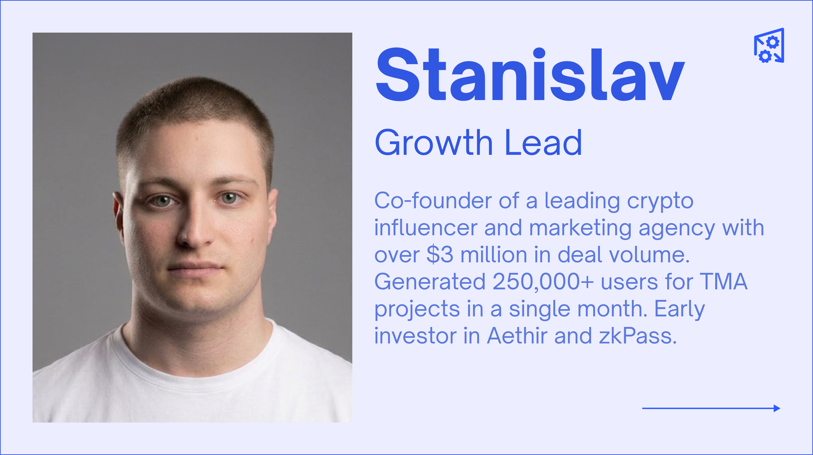

# Team

PolyHelper was built by a team of Polymarket insiders, engineers, and crypto veterans — people who traded on the platform themselves and saw firsthand what was missing.

<figure><figcaption></figcaption></figure>

---

## Co-Founders & Core Team

### Valeriy — CMO, Co-Founder

<figure><figcaption></figcaption></figure>

Valeriy is one of the most recognized names in the Polymarket community. As a **Polymarket Ambassador** with the coveted traders badge, he has been embedded in the prediction market ecosystem since its early days.

**Background:**
- Built Polymarket's official Telegram channel and ran the **@PolymarketTraders** community
- **$5M+ personal trading volume** on Polymarket — he doesn't just build tools, he uses them
- Founded **Whales KOLs** — one of the top-3 largest KOL communities in the crypto space

His deep roots in the Polymarket community mean that PolyHelper's features are shaped by real trading experience, not theory.

**X:** [@0xd1namit](https://x.com/0xd1namit)

---

### Andrey — CTO, Co-Founder

<figure><figcaption></figcaption></figure>

Andrey is the technical backbone of PolyHelper. With a track record of building products at massive scale, he brings serious engineering depth to the project.

**Background:**
- **Fullstack engineer at Spaceflight Simulator** — a game with 10M+ installs
- **CTO at Dzeta.tech** — led technical strategy at an established tech company
- Experienced in building browser extensions, real-time data systems, and scalable web infrastructure

His engineering experience translates directly into PolyHelper's performance and reliability.

**LinkedIn:** [andrey-onischenko](https://www.linkedin.com/in/andrey-onischenko-9059a270/)
**GitHub:** [cucumber-sp](https://github.com/cucumber-sp)

---

### Stanislav — Growth Lead

<figure><figcaption></figcaption></figure>

Stanislav drives PolyHelper's growth, partnerships, and community expansion. His track record in crypto growth is exceptional.

**Background:**
- **Co-founder of a leading crypto influencer and marketing agency** with over $3M in deal volume
- Generated **250,000+ users** for Telegram Mini App (TMA) projects in a single month
- Early investor in **Aethir** and **zkPass** — two of the most successful Web3 projects of recent years

His ability to drive user acquisition at scale is what has made PolyHelper one of the fastest-growing tools in the Polymarket ecosystem.

---

### Alex — CBDO (Chief Business Development Officer)

<figure><figcaption></figcaption></figure>

Alex leads PolyHelper's business development, partnerships, and strategic relationships.

**Background:**
- **Head of Ventures at InnMind.com** — a leading platform connecting Web3 startups with investors
- **BD at Camp Network** — helped build partnerships for a project that raised a **$30M Series A from 1kx + Blockchain Capital**, two of the most prestigious funds in the space

His network and BD experience are key to PolyHelper's integration partnerships and long-term growth trajectory.

**LinkedIn:** [alex-onishenko](https://www.linkedin.com/in/alex-onishenko/)

---

## Why This Team?

What makes the PolyHelper team unique is that they are **active Polymarket users** who built the tool they themselves needed. This is not a team of outsiders trying to build for a community they don't understand.

- **Valeriy** trades $5M+ on Polymarket and knows exactly what edge traders need
- **Andrey** has the technical depth to build fast, reliable data infrastructure at scale
- **Stanislav** has proven he can grow communities to hundreds of thousands of users
- **Alex** has the network and BD experience to build the partnerships that expand PolyHelper's data capabilities

---

## Contact the Team

- **Twitter/X:** [@Poly_Helper](https://x.com/Poly_Helper)
- **Discord:** [discord.gg/2RfMcye8fG](https://discord.gg/2RfMcye8fG)
- **Telegram:** [t.me/polyhelper](https://t.me/polyhelper)
- **Website:** [polyhelper.io](https://polyhelper.io)
