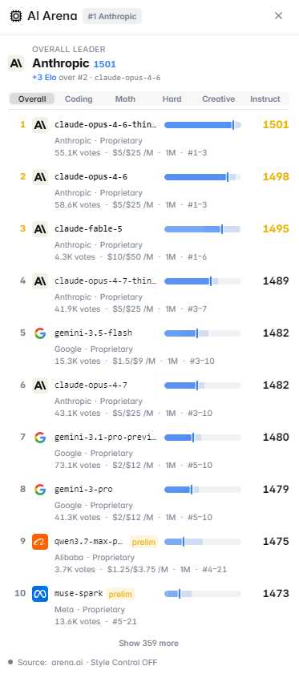

# AI Arena

The **AI Arena** panel tracks AI model performance leaderboards, benchmark scores, and capability rankings — providing context for Polymarket's fast-growing AI technology market category.

<figure><figcaption>AI Arena showing model leaderboard and benchmark scores</figcaption></figure>

---

## What It Shows

### Model Leaderboard
A real-time ranking of leading AI models across major providers (OpenAI, Anthropic, Google, Meta, Mistral, and others), ranked by:
- Overall capability score
- Category-specific performance
- Recent ranking changes (which models are rising or falling)

### Benchmark Categories

| Category | What It Measures |
|---|---|
| Reasoning | Complex multi-step logical problems |
| Coding | Code generation and debugging accuracy |
| Math | Mathematical problem solving |
| Language | Writing quality, instruction following |
| Multimodal | Vision + text combined tasks |
| Context Length | Ability to handle long documents |
| Speed | Tokens per second (inference speed) |

### Score History
Track how individual models' benchmark scores have changed over time — useful for markets about whether a specific model will maintain or lose its top ranking.

### New Model Releases
A feed of recently released AI models, including:
- Model name and provider
- Key claimed capabilities
- Initial benchmark results
- Links to technical reports or announcements

<figure><figcaption>Detailed benchmark breakdown by category</figcaption></figure>

---

## Why This Matters for Polymarket

AI markets on Polymarket have exploded in variety and volume, covering questions like:
- "Will GPT-5 score higher than [Model] on [Benchmark]?"
- "Will Anthropic release a new model in [month]?"
- "Which AI company will release the best model of [year]?"
- "Will [Model] still be #1 on the coding leaderboard by [date]?"

The AI Arena panel gives you the current baseline data to evaluate these markets intelligently.

---

## How to Use It

**For model ranking markets** (e.g., "Will Claude 4 be ranked #1 on [benchmark] by [date]?"):
1. Check the current leaderboard position of the model
2. Look at the trend — is it rising or falling in rankings?
3. Check recent new model releases — upcoming launches could displace current leaders

**For release timeline markets** (e.g., "Will [Company] release a new model before [date]?"):
1. Check the model release history — how frequently does this company release new models?
2. Look for leaked benchmark scores or beta access announcements in the feed

---

## Data Sources

AI Arena aggregates data from:
- **LMSYS Chatbot Arena** — human preference-based model rankings
- **HuggingFace Open LLM Leaderboard** — standardized benchmark scores
- **Artificial Analysis** — independent performance and cost benchmarks
- Official model release announcements and technical papers

---

## Markets Where This Panel Activates

- AI model ranking and performance markets
- AI company release timeline markets
- AI capability milestone markets (AGI, specific benchmark thresholds)
- Technology company markets where AI is a key factor
