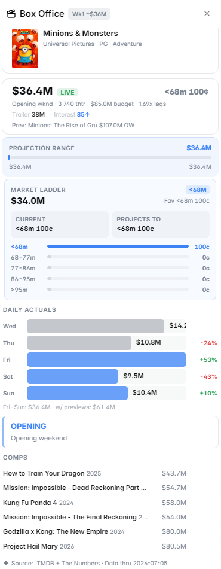

# Box Office

The **Box Office** panel provides weekend revenue projections for movies using industry-standard decay modeling — giving you data-driven estimates for Polymarket's entertainment and film markets.

<figure><figcaption>Weekend box office projections for current releases</figcaption></figure>

---

## What It Shows

### Weekend Projections
Projected weekend box office gross for films currently in theaters or opening soon:
- Opening weekend estimate (for new releases)
- Second/third weekend estimate (applying decay factors)
- Running total to date
- Projected total domestic gross

### Tracking Data
For major upcoming releases:
- Pre-release tracking numbers (industry surveys of audience awareness and intent-to-see)
- Comparison to similar films at the same tracking stage
- Historical performance of the director, franchise, or studio

### Live Box Office
During weekends (Friday–Sunday):
- Friday actuals (early indicator for full weekend performance)
- Saturday estimates
- Projected Sunday close

Friday performance is a strong predictor of the full weekend — a film that underperforms on Friday typically underperforms for the whole weekend.

<figure><figcaption>Live Friday-to-Sunday box office tracking</figcaption></figure>

---

## Decay Modeling Explained

Box office revenue follows a predictable **decay pattern** week over week. A typical film loses:

| Weekend | Typical Drop from Previous Weekend |
|---|---|
| Opening → Week 2 | -40% to -60% |
| Week 2 → Week 3 | -30% to -40% |
| Week 3+ | -20% to -30% per week |

**Exceptions that cause slower decay (longer legs):**
- Strong word of mouth (high CinemaScore, positive reviews)
- Family films with repeat viewership
- Holiday weekends

**Exceptions that cause faster decay:**
- Front-loaded opening (opening weekend driven by super-fans, not general audiences)
- Poor reviews or social media backlash
- Competition from a new major release

The Box Office panel applies these decay curves to generate multi-week projections.

---

## How to Use It

**For opening weekend markets** (e.g., "Will [Movie] open above $X million?"):
1. Check current tracking numbers — how does awareness and intent-to-see compare to similar films?
2. Look at comparable film openings at similar tracking stages
3. Factor in release date competition (is anything else opening that weekend?)

**For total gross markets** (e.g., "Will [Movie] gross $X million domestic?"):
1. Check the current running total
2. Apply the projected decay curve to estimate remaining weekends
3. Factor in awards season exposure or other longevity drivers

---

## Markets Where This Panel Activates

- Opening weekend box office markets
- Total domestic gross markets
- International box office markets
- Awards (Oscars) markets where box office performance is a factor
