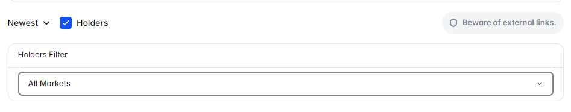

# Comments Filter

The **Comments Filter** is a quality-of-life tool that transforms Polymarket's market comment section from noise into signal — by letting you filter comments based on the poster's actual market position.

<figure><figcaption>Comments filtered by position — YES holders only</figcaption></figure>

---

## The Problem

Every Polymarket market has a comment section where traders share their reasoning, research, and predictions. But without context, it's hard to evaluate any comment:

- Is this person bullish because they genuinely think YES wins — or because they're trying to influence other traders?
- Is the bearish comment from someone who has done real research — or someone who is already short and trying to move the market?

**The position of the commenter matters enormously** when evaluating their argument.

---

## What the Filter Does

The Comments Filter enriches each comment with the commenter's position data:

| Data Point | Description |
|---|---|
| Position | YES or NO |
| Position Size | How many shares they hold |
| Avg. Entry Price | What price they paid |
| Current PnL | Whether they're up or down |

This lets you immediately see whether a commenter's argument aligns with or contradicts their financial interest.

---

## Filter Options

### Filter by Side
- **Show All** — default Polymarket view
- **YES Holders Only** — see arguments from people holding YES positions
- **NO Holders Only** — see arguments from people holding NO positions

### Sort Options
- **Most Recent** — default chronological sort
- **Largest Position First** — show comments from the biggest holders first
- **Most Profitable First** — show comments from traders who are most profitable in this market
- **Most Replied** — show comments generating the most engagement

### Minimum Position Filter
Set a minimum position size threshold — filter out comments from traders with very small positions (less likely to represent serious research).

<figure><figcaption>Sorted by largest position first — the most committed traders</figcaption></figure>

---

## How to Interpret Filtered Comments

**Large YES holder making a bullish argument**
- They're putting their money where their mouth is. The argument carries more weight — but also consider they have an incentive to sound convincing.

**Small YES holder making a bearish argument (unusual)**
- Worth reading carefully — someone who holds YES but argues it might lose has no incentive to talk down their position. This could be genuine hedging insight.

**Large NO holder making a bullish argument (unusual)**
- Extremely interesting case — could indicate they're preparing to flip, or testing the market's reaction to a bullish narrative.

**Multiple large holders on opposite sides with strong arguments**
- The market genuinely has two sides of informed opinion. This is where prediction markets are most valuable — smart money disagrees.

---

## Why This Matters

In prediction markets, **information and incentives are inseparable**. A commenter arguing "YES is a sure thing" while holding a large YES position is providing biased information — even if unconsciously.

The Comments Filter doesn't eliminate bias, but it makes bias transparent. You can now read comments knowing exactly what the commenter stands to gain.

---

## Markets Where This Feature Activates

The Comments Filter works on **all Polymarket event pages** that have a comment section.
