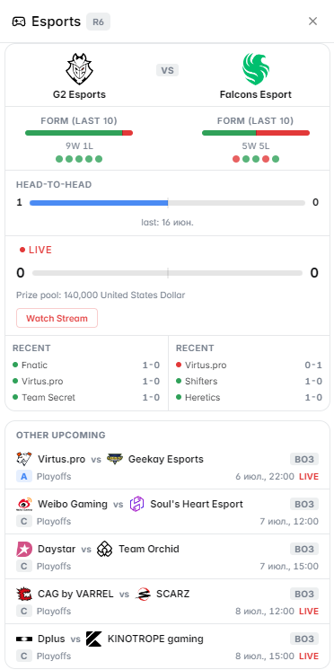

# Esports Context

The **Esports Context** panel brings competitive gaming standings, team stats, and tournament data into Polymarket — covering the biggest titles in esports.

<figure><figcaption>Esports Context panel on a LoL tournament market</figcaption></figure>

---

## Supported Games

| Game | Coverage |
|---|---|
| 🟡 League of Legends | LCK, LEC, LCS, MSI, Worlds standings & results |
| ⚔️ Valorant | VCT standings, team rankings, recent match results |
| 🐉 Dota 2 | DPC leagues, The International, team records |

---

## What It Shows

### Team Standings
Current standings in the relevant league or tournament:
- Win/loss record
- Points and position in group/league table
- Recent form (last 5 matches)

### Recent Match Results
Latest match results for teams in the market:
- Score and map breakdown
- Opponents faced and their current ranking
- Notable series wins/losses

### Head-to-Head History
Direct matchup history between two teams:
- All-time record
- Recent meetings (last 3–5 series)
- Performance in high-stakes matches (playoffs, internationals)

### Tournament Context
Where in the tournament the match takes place:
- Group stage vs. playoffs vs. grand final
- Current bracket position
- Stakes (elimination, advancement, seeding)

### Player Roster
Current active roster for each team:
- Player names and roles
- Notable recent individual performances
- Any roster changes or substitutions

<figure><figcaption>Live tournament bracket and standings</figcaption></figure>

---

## How to Use It

**For match winner markets** (e.g., "Will [Team A] beat [Team B]?"):
1. Check recent form — teams on win streaks carry momentum
2. Review H2H record — some teams systematically struggle against specific opponents
3. Look at tournament stage — teams often perform differently in group stage vs. playoffs

**For tournament outcome markets** (e.g., "Will [Team] win Worlds?"):
1. Check current bracket position and remaining opponents
2. Review performance against top seeds
3. Look at regional performance — some regions historically over/underperform at internationals

---

## Markets Where This Panel Activates

- LoL, Valorant, and Dota 2 match winner markets
- Tournament winner and placement markets
- Regional championship markets
- Any market involving esports teams or events
