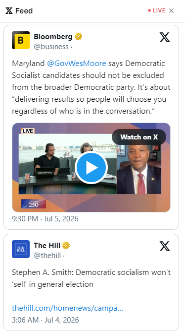

# Live News Tab

The **Live News Tab** aggregates breaking news and real-time updates from the most trusted, market-relevant sources on X (formerly Twitter) — displayed directly inside Polymarket so you never miss a catalyst.

<figure><figcaption>Live News Tab showing real-time updates relevant to the current market</figcaption></figure>

---

## How It Works

PolyHelper maintains a curated list of high-signal news and intelligence accounts on X. When you open a Polymarket event page, the Live News Tab automatically filters and surfaces posts that are relevant to that specific market — based on tickers, topics, keywords, and entity names.

**Sources include:**
- Macro economic reporters and journalists
- Crypto news accounts and on-chain analysts
- Sports beat reporters and official team accounts
- Political journalists and campaign trackers
- Intelligence and geopolitical analysts
- Official government and institutional feeds

---

## Key Features

### Context-Aware Filtering
The news feed is **not a generic news stream** — it's filtered to the market you're currently viewing. If you're on a Bitcoin price market, you see crypto news. On an election market, you see political updates.

### Real-Time Updates
New posts appear in the feed as they're published — typically with a delay of under 1 minute from the original post on X.

### Trusted Sources Only
The PolyHelper team manually curates the source list, filtering out noise, low-quality accounts, and sources known for spreading misinformation. This keeps the signal-to-noise ratio high.

### Direct Links
Every news item links directly to the original post on X, letting you verify the source and see full context in one click.

<figure><figcaption>Each item links directly to the source on X</figcaption></figure>

---

## Why This Matters

**Information asymmetry is one of the biggest edges in prediction markets.**

Professional traders monitor dozens of feeds simultaneously to catch market-moving news before it's priced in. The Live News Tab democratizes this — giving every PolyHelper user the same real-time awareness.

Examples of market-moving news the tab helps you catch early:
- Fed official comments ahead of rate decisions
- Sports injury announcements during warmups
- Breaking geopolitical events affecting conflict markets
- Crypto exchange listings or regulatory announcements
- Polling releases or campaign developments

---

## Customization

> *Note: Full customization features are in development. The source list is currently managed by the PolyHelper team based on community feedback.*

You can suggest sources to add by messaging [@Poly_Helper on X](https://x.com/Poly_Helper) or posting in the [Discord](https://discord.gg/2RfMcye8fG).

---

## Markets Where This Panel Activates

The Live News Tab is available on **all Polymarket event pages** — it's one of the few universal panels that loads regardless of market category.
