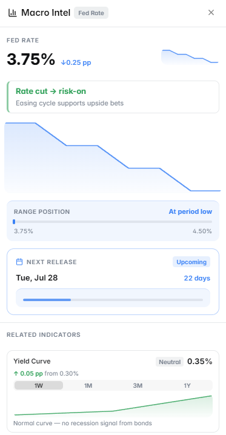

# Macro Intel

The **Macro Intel** panel tracks Federal Reserve policy, economic indicators, and macroeconomic data — essential context for trading markets tied to interest rates, inflation, and the broader economy.

<figure><figcaption>Macro Intel panel showing Fed rates and economic indicators</figcaption></figure>

---

## What It Shows

### Federal Reserve Data
- **Current federal funds rate** — the benchmark interest rate set by the Fed
- **Next FOMC meeting date** — when the next rate decision will be announced
- **CME FedWatch probabilities** — market-implied odds of a rate hike, hold, or cut
- **Historical rate path** — how rates have changed over the past 12–24 months

### Economic Indicators
Key macro data points updated as new reports are released:

| Indicator | Frequency | Why It Matters |
|---|---|---|
| CPI (Inflation) | Monthly | Drives Fed rate decisions; affects crypto and equities |
| PCE (Core Inflation) | Monthly | Fed's preferred inflation measure |
| NFP (Jobs Report) | Monthly | Signals economic health and Fed policy direction |
| GDP Growth | Quarterly | Overall economic expansion or contraction |
| Unemployment Rate | Monthly | Labour market tightness; influences Fed policy |
| PMI (Manufacturing & Services) | Monthly | Forward-looking economic activity indicator |

### Upcoming Economic Calendar
A schedule of upcoming major economic releases:
- Date and time of release
- Previous reading
- Consensus forecast
- Actual (when released)

Releases that beat or miss consensus often cause sharp price movements across Polymarket's financial and crypto markets.

<figure><figcaption>Upcoming economic releases with consensus expectations</figcaption></figure>

---

## Why It Matters for Polymarket

**Interest rate markets** are among the most actively traded on Polymarket. Markets like "Will the Fed cut rates in [month]?" directly reference the data shown in this panel.

**Crypto markets** are heavily influenced by macro conditions — when the Fed turns dovish (cutting rates), risk assets like Bitcoin typically rally. When inflation surprises to the upside, markets often price in fewer cuts.

**Stock markets** react immediately to macro surprises — earnings season + macro context together drive stock-related market outcomes.

---

## How to Use It

**For Fed rate markets** (e.g., "Will the Fed cut rates by 25bps in September?"):
1. Check current CME FedWatch odds — this is the market consensus
2. Look at recent CPI and PCE data — inflation drives rate expectations
3. Check NFP data — strong jobs numbers typically delay rate cuts

**For macro-sensitive crypto markets:**
1. Check where the Fed rate cycle is — beginning of cuts = bullish for crypto
2. Look at upcoming economic events — surprise data can move markets before resolution

---

## Markets Where This Panel Activates

- Federal Reserve rate decision markets
- Inflation / CPI markets
- GDP and economic data markets
- Any crypto or stock market where macro context is relevant
