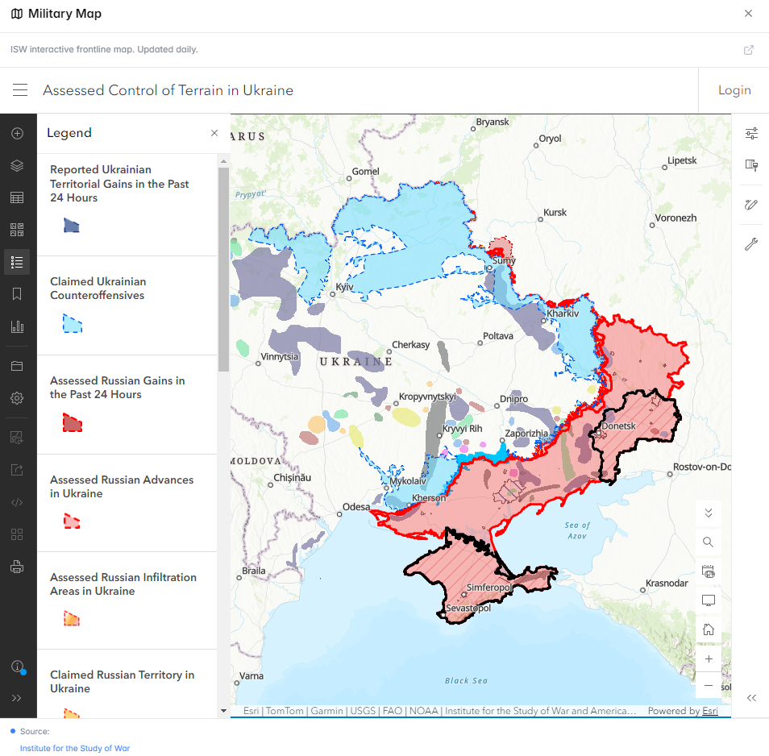

# Military Maps

The **Military Maps** panel integrates ISW (Institute for the Study of War) situation reports and interactive frontline maps directly into Polymarket — the gold standard for conflict analysis.

<figure><figcaption>ISW frontline map integrated into a conflict market page</figcaption></figure>

---

## What Is ISW?

The **Institute for the Study of War (ISW)** is a non-partisan American think tank founded in 2007. It produces some of the most widely-cited open-source military assessments in the world, including:

- Daily situation reports for active conflicts
- High-resolution frontline and control maps updated regularly
- Operational analysis of military movements and tactics
- Assessment of strategic trends and escalation risks

ISW maps are used by journalists, governments, military analysts, and researchers worldwide as the most reliable open-source representation of conflict frontlines.

---

## What the Panel Shows

### Interactive ISW Maps
Embedded, zoomable ISW maps showing:
- Current territorial control lines (updated daily or when significant changes occur)
- Contested areas (ongoing fighting)
- Recent gains and losses (color-coded by timeframe)
- Key geographic features (cities, rivers, infrastructure)

### ISW Daily Summaries
Condensed versions of ISW's daily situation reports, highlighting:
- Key events from the last 24 hours
- Significant territorial changes
- ISW's assessment of the operational situation

### Map History
Compare maps over time to see how the frontline has evolved:
- Last 7 days
- Last 30 days
- Since conflict began (available for major ongoing conflicts)

<figure><figcaption>Compare frontline positions over different time periods</figcaption></figure>

---

## Why ISW?

ISW is used as the data source because:

1. **Daily updates** — ISW publishes situation reports every single day for active conflicts
2. **Rigorous sourcing** — ISW analysts cross-verify multiple OSINT sources before publishing
3. **Non-partisan** — ISW does not advocate for any side; their assessments reflect ground truth
4. **Widely trusted** — used by media, governments, and defense analysts as a credible reference
5. **Map precision** — ISW maps are more detailed and frequently updated than any other free source

---

## How to Use It

**For territorial control markets** (e.g., "Will [Side] control [Location] by [date]?"):
1. Check the current ISW map — who controls the location now?
2. Look at the trend over the last 30 days — is the area changing hands?
3. Read the ISW assessment — are they calling it contested or firmly controlled?

**For conflict duration markets** (e.g., "Will the conflict still be active by [date]?"):
1. Review ISW's operational assessment — are there signs of a stalemate or decisive movement?
2. Check whether major supply lines and logistics are intact for both sides

---

## Companion Tools

Military Maps is part of Poly Helper's geopolitical intelligence suite:
- [Pentagon Activity Tracker →](pentagon-tracker.md) — US/NATO signals and PizzINT
- [Conflict Radar →](conflict-radar.md) — Global conflict overview and event feed

---

## Markets Where This Panel Activates

- Territorial control markets
- City/region capture or defense markets
- Conflict duration and outcome markets
- Any market where frontline positions are relevant
