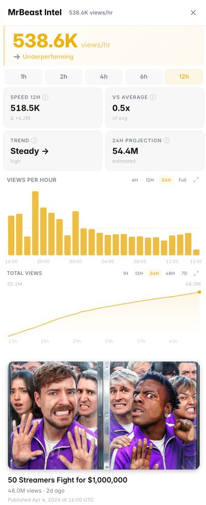

# MrBeast Intel

The **MrBeast Intel** panel tracks video velocity, view counts, and audience attention signals for YouTube-related Polymarket events — giving you real data to trade markets about YouTube content performance.

<figure><figcaption>MrBeast Intel panel showing video velocity signals</figcaption></figure>

---

## What It Shows

### Video Velocity
Real-time and historical view count data for relevant videos:
- Total views (current)
- Views per hour (velocity)
- Views per day trend
- Rate of acceleration (is the video picking up or slowing down?)

### Attention Signal
Engagement metrics that indicate audience interest beyond just views:
- Like count and like/view ratio
- Comment volume
- Share rate
- Click-through rate signals (where available)

### Channel Performance
For creator-specific markets:
- Subscriber count and recent growth
- Average views per video (30-day average)
- Upload frequency
- Trending status

### Comparison to Benchmarks
How does the current video's performance compare to:
- This creator's historical average
- Similar videos in the same category
- Top-performing videos on the platform

<figure><figcaption>View velocity trend for a YouTube market</figcaption></figure>

---

## Why This Matters

YouTube markets on Polymarket typically ask questions like:
- "Will this video reach X million views by [date]?"
- "Will [Creator] upload a video in [month]?"
- "Which video will have more views?"

**Video velocity is the key signal.** A video that reaches 10M views in the first 48 hours is on a very different trajectory than one that slowly builds over weeks. The MrBeast Intel panel gives you the velocity data to assess where a video is heading.

---

## How to Use It

**For view count milestone markets** (e.g., "Will this video hit 100M views?"):
1. Check current view count and how far from the target
2. Look at the velocity trend — is it accelerating, stable, or decelerating?
3. Compare to similar videos by the same creator — how long did they take to reach comparable milestones?

**For upload markets** (e.g., "Will MrBeast upload a video this week?"):
1. Check recent upload frequency — how often does this creator post?
2. Look for any announced upcoming content

---

## Markets Where This Panel Activates

- YouTube view count markets
- Creator upload frequency markets
- Video performance and ranking markets
- Any market involving YouTube content or creators
