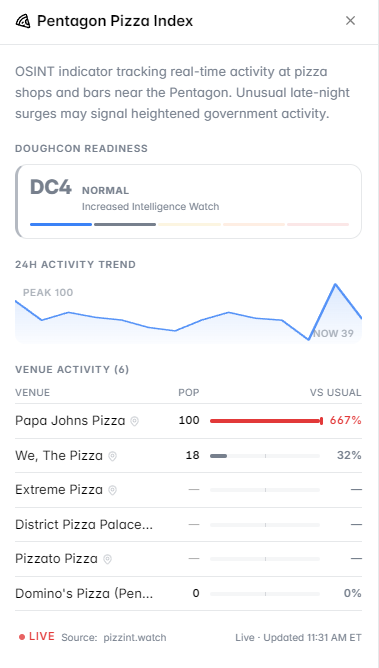

# Pentagon Activity Tracker (PizzINT)

The **PizzINT** panel tracks orders and activity at pizza places and gay bars near the Pentagon — a real OSINT technique used to detect unusual government activity before official announcements.

<figure><figcaption>PizzINT — tracking Pentagon-area activity as an early signal</figcaption></figure>

---

## The Concept

**PizzINT** is a legitimate open-source intelligence method. The logic is simple:

- When something big is happening inside the Pentagon late at night, staff work overtime
- Overtime means food deliveries — especially pizza
- Unusual spikes in pizza orders (or foot traffic at nearby bars) near government buildings can signal that something is going on *before* it becomes public

The same principle applies to gay bars near certain embassies and government facilities — historically used as soft indicators of unusual activity among government personnel.

---

## What the Panel Shows

- Activity levels at tracked locations near the Pentagon
- Unusual spikes vs. normal baseline
- Time and recency of the signal

---

## How to Use It

When the panel shows elevated activity at an unusual hour — especially late at night or on weekends — it can be worth checking whether any geopolitical or defense-related markets are moving on Polymarket.

It's a soft signal, not a hard data source. Use it as one input alongside other indicators.

---

## Markets Where This Panel Activates

- US defense and military markets
- Geopolitical conflict and escalation markets
- Any market where unexpected US government activity would be relevant
