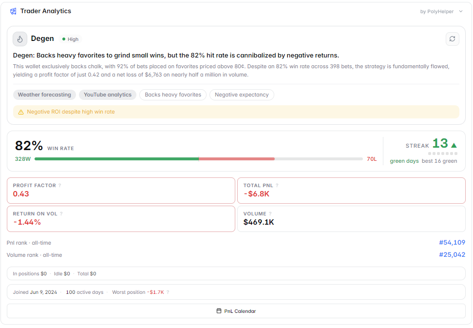

# Profile Enhancer

The **Profile Enhancer** upgrades Polymarket's native trader profile pages with extended analytics — turning basic profile views into deep trader intelligence reports.

<figure><figcaption>Enhanced trader profile with extended analytics</figcaption></figure>

---

## What It Adds to Profile Pages

When you visit any Polymarket trader's profile page, Profile Enhancer automatically loads additional data layers on top of the native profile.

### Extended PnL Breakdown
Beyond the basic PnL number shown by Polymarket:
- PnL by market category (Crypto, Politics, Sports, etc.)
- PnL over different time periods (7d, 30d, 90d, all-time)
- Best and worst performing markets
- Win rate by category — where is this trader actually skilled vs. lucky?

### Trading Pattern Analysis
- Most active market categories
- Average position size and hold duration
- Frequency of trading (daily, weekly, occasional)
- Tendency to trade pre-event vs. close to resolution

### Market Concentration
- What % of their portfolio is in their top 3 markets
- Diversification score — do they spread across many markets or concentrate heavily?
- Current open positions and their sizes

### Historical Performance Chart
A visual equity curve showing how this trader's total PnL has changed over time — making it easy to see if their performance is consistent or driven by a few lucky trades.

<figure><figcaption>Historical PnL curve for a trader profile</figcaption></figure>

---

## Why It's Useful

Polymarket's native profile pages show basic information. Profile Enhancer answers the questions that actually matter when evaluating a trader:

- **Is this trader consistently good, or did they get lucky once?**
- **What categories are they actually skilled in?**
- **Are they a high-volume scalper or a slow, concentrated bettor?**
- **Should I follow their positions or fade them?**

---

## How to Use It

1. Navigate to any Polymarket trader's profile (click their wallet/name on a market page)
2. Profile Enhancer loads automatically — you'll see new analytics sections below the native profile
3. Review the category breakdown to understand where their edge comes from
4. Use the historical PnL chart to distinguish consistent performers from lucky one-timers
5. Check their current open positions — are they currently in markets you're also trading?

---

## Works With Trader Tracker

Profile Enhancer and [Trader Tracker](trader-tracker.md) work well together:

- Use **Profile Enhancer** to evaluate whether a trader is worth following
- Use **Trader Tracker** to monitor them in real time once you've decided they're worth watching

---

## Markets Where This Feature Activates

Profile Enhancer activates on **any Polymarket trader profile page** — it's not market-specific.
