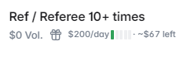

# Rewards Pool Calculator

The **Rewards Pool Calculator** helps liquidity providers on Polymarket estimate their potential earnings from the LP rewards program — making it easy to calculate returns before committing capital.

<figure><figcaption>LP Rewards Calculator showing estimated earnings</figcaption></figure>

---

## Background: Polymarket LP Rewards

Polymarket runs a **liquidity provider (LP) rewards program** that incentivizes traders to provide liquidity to markets by placing limit orders. LPs earn a share of a rewards pool proportional to:

1. The amount of liquidity they provide
2. How close to the current market price their orders are placed
3. How long their orders remain active

Understanding how much you can earn from LP rewards — before you commit capital — is what the Rewards Pool Calculator enables.

---

## What the Calculator Shows

### Input Fields
Enter your intended liquidity position:
- **Order size** — how much USDC you plan to commit
- **Spread** — how far from mid-price your orders are placed (tighter spread = more rewards, more risk)
- **Duration** — how long you plan to keep orders active

### Output Estimates
- **Estimated daily rewards** (points / USDC equivalent)
- **Estimated weekly rewards**
- **Estimated monthly rewards**
- **APY equivalent** — annualized return on your committed capital
- **Your estimated share of the total rewards pool** (%)

### Pool Share Visualization
See how your position compares to the total liquidity in the market — helping you understand whether you'll be a small or significant contributor to the pool.

<figure><figcaption>Estimated earnings breakdown by timeframe</figcaption></figure>

---

## How to Use It

**Step 1:** Find a market you want to provide liquidity to on Polymarket

**Step 2:** Open the Rewards Pool Calculator panel on that market's page

**Step 3:** Enter your intended position size and spread

**Step 4:** Review the estimated rewards — compare the APY to your risk exposure

**Step 5:** If the returns look attractive, go to Polymarket's order book and place your limit orders

---

## Understanding the Trade-offs

| Tighter Spread | Wider Spread |
|---|---|
| Higher rewards | Lower rewards |
| More risk of adverse selection | Less exposure to informed traders |
| Orders fill more often | Orders fill less often |
| Better for stable, well-priced markets | Better for volatile, uncertain markets |


LP rewards are separate from PolyHelper's own [points & airdrop program](../rewards/program.md). You can earn both simultaneously.


---

## Markets Where This Panel Activates

The Rewards Pool Calculator is available on all Polymarket markets that have an active LP rewards program. Markets with higher trading volume and rewards pool allocations will show higher estimated returns.
