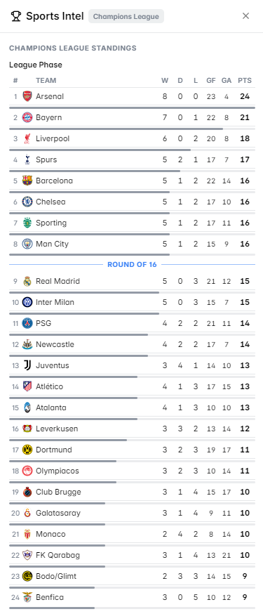

# Sports Intel

The **Sports Intel** panel brings live scores, team statistics, and match context directly into Polymarket — eliminating the need to open ESPN, Google Sports, or any external site while you trade sports markets.

<figure><figcaption>Sports Intel panel showing live NBA game data</figcaption></figure>

---

## Supported Sports

| Sport | Coverage |
|---|---|
| 🏀 NBA | Live scores, player stats, standings, injury reports |
| 🏈 NFL | Live scores, team stats, injury reports, weather conditions |
| ⚾ MLB | Live scores, pitcher stats, team ERA, batting averages |
| 🏒 NHL | Live scores, team records, goalie stats |
| ⚽ Soccer | Live scores, league tables, goal stats — major leagues worldwide |
| 🏎️ Formula 1 | Session results, qualifying, standings, weather at circuit |

---

## What the Panel Shows

### Live Score Display
Real-time scoreboard for the game or match related to the market you're viewing:
- Current score
- Period / quarter / inning / half
- Time remaining
- Possession / game state indicators

### Team Statistics
Key stats for both teams/sides:
- Season record (W-L)
- Recent form (last 5 games)
- Head-to-head history
- Home vs. away performance

### Player Information
For player-specific markets:
- Individual stats relevant to the market (points per game, goals, etc.)
- Recent performance (last 3–5 games)
- Injury status and availability

### Injury Reports
Live updates on player availability — critical for markets about game outcomes or player performance.

<figure><figcaption>Injury report integration in the Sports Intel panel</figcaption></figure>

---

## How to Use It

**For game outcome markets** (e.g., "Will [Team A] beat [Team B]?"):
1. Review both teams' recent form and H2H record
2. Check injury reports — missing key players drastically shifts odds
3. For NFL: check weather conditions at the venue (impacts passing game)

**For player performance markets** (e.g., "Will [Player] score 25+ points?"):
1. Look at the player's recent game averages
2. Check matchup — is the opposing defense weak or strong against this position?
3. Review injury status and expected minutes

**For season-long markets** (e.g., "Will [Team] make the playoffs?"):
1. Check current standings and record
2. Count remaining games and difficulty of schedule

---

## Sport-Specific Notes

### NBA
The panel integrates with real-time NBA data feeds, showing quarter-by-quarter scoring, team fouls, and player point totals mid-game — useful for live trading on in-progress game markets.

### NFL
Includes **weather data at game venue** — important for over/under markets where wind and rain significantly affect scoring.

### Formula 1
Shows session-by-session results: Practice 1/2/3, Qualifying, Sprint, Race. Useful for markets about race winners, fastest lap, or constructor standings.

### Soccer
Covers all major leagues including Premier League, La Liga, Bundesliga, Serie A, Ligue 1, Champions League, and major international tournaments.

---

## Markets Where This Panel Activates

- Any market mentioning an NBA, NFL, MLB, NHL, soccer, or F1 team or player
- Season outcome markets (championships, playoffs, relegation)
- Player performance markets (points, goals, assists, stats thresholds)
