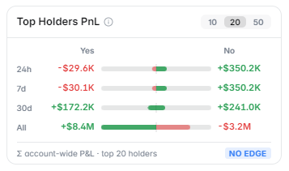

# Top Holders PnL

The **Top Holders PnL** panel reveals how the largest position holders in a market are performing — giving you a real-time view of smart money flows.

<figure><figcaption>Top Holders PnL panel showing position performance data</figcaption></figure>

---

## What It Shows

For each major position holder in the market, the panel displays:

| Field | Description |
|---|---|
| Wallet Address | Shortened address (clickable to view full history) |
| Position | YES or NO, and the size (shares held) |
| Avg. Entry Price | The average price they paid per share |
| Current PnL | Unrealized profit or loss at current odds |
| Time Windows | Performance over 24h, 7d, and 30d periods |

---

## Time Period Views

Switch between three views using the tabs at the top of the panel:

- **24h** — Who made or lost money today? Useful for identifying recent market movers
- **7d** — Weekly performance — shows who has been consistently right
- **30d** — Long-term view — identifies the most reliable traders in this market

---

## Why This Is Powerful

### Follow Smart Money
When the most profitable traders in a market are heavily positioned on one side, it's a signal worth paying attention to. The PnL data shows you not just *what* people are holding, but *how well they're doing* — letting you distinguish lucky from skilled.

### Spot Informed Traders
Large positions combined with strong PnL history often indicate informed traders — participants with real research or insider knowledge of the outcome. This is especially relevant for:
- Political markets (campaigns, insiders)
- Crypto markets (protocol teams, VCs)
- Sports markets (team insiders, injury knowledge)

### Identify Whale Positioning
Large position changes by top holders can signal new information entering the market — even before it shows up in price movement.

<figure><figcaption>Clicking a holder shows their full position history</figcaption></figure>

---

## How to Interpret the Data

**High positive PnL across 7d and 30d** → This holder has been consistently right. Their current position is worth tracking closely.

**Large position + near-zero PnL** → Big holder who entered recently or at current odds. Neutral signal — they haven't been proven right or wrong yet.

**Negative PnL + large position** → This holder may be averaging down or "bag holding." A contrarian signal — consider whether the market has moved against them for a reason.

**Multiple top holders all on the same side** → Strong directional consensus among largest traders. Can indicate a well-researched consensus or a crowded trade (risk of sharp reversal if they exit).

---

## Limitations & Caveats


PnL data is **unrealized** — it reflects the current market price, not final settlement. A trader with a large positive PnL could still lose if the market resolves against them.


- Wallet addresses are pseudonymous — you cannot verify identity without additional research
- Large holders may be hedging across multiple markets (a big YES position here might be a hedge against another trade)
- PnL doesn't account for gas fees or trading costs on Polymarket

---

## Markets Where This Panel Activates

Top Holders PnL is available on **all Polymarket event pages** with sufficient liquidity and holder data.
