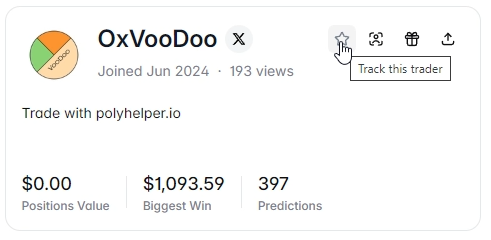

# Trader Tracker

The **Trader Tracker** lets you follow specific Polymarket traders, organize them into groups, and monitor their live activity across all markets — turning public trading data into a personal intelligence feed.

<figure><figcaption>Trader Tracker showing followed traders and their recent activity</figcaption></figure>

---

## What It Does

### Follow Traders
Add any Polymarket wallet address to your tracked list. Once followed, their trading activity surfaces in your Trader Tracker feed automatically — across every market they trade.

### Group Organization
Organize followed traders into custom groups:
- **Smart Money** — wallets with consistently strong PnL
- **Insiders** — wallets that seem to have early information
- **Faders** — wallets worth betting against
- Any custom group name you create

Groups let you quickly filter your feed to see activity from specific categories of traders.

### Live Activity Feed
See real-time updates when followed traders:
- Open a new position
- Add to an existing position
- Exit a market
- Move into a market you're not currently watching

This gives you a live pulse on what informed traders are doing — before price moves reflect it.

### Trader Stats
For each followed trader, view:
- Total PnL (all-time and recent)
- Win rate across resolved markets
- Favorite market categories
- Most recent trades

<figure><figcaption>Live feed of followed traders' activity</figcaption></figure>

---

## How to Use It

### Finding Good Traders to Follow
1. Open any market's **Top Holders PnL** panel
2. Identify wallets with strong 30-day PnL and large positions
3. Click the wallet address → **Follow** to add them to Trader Tracker
4. Assign them to a group (e.g., "Smart Money")

### Using the Feed Strategically
- **New position from a high-PnL wallet** → investigate that market
- **Multiple tracked wallets entering the same market** → strong signal worth researching
- **Tracked wallet exiting a position early** → potential information about the outcome

### Building a "Fade" List
Some traders are reliably wrong. Track them in a "Fade" group and consider trading the opposite direction when they make large moves.

---

## Why It's Powerful

Polymarket is a public blockchain — all trades are visible. Most traders don't take advantage of this. Trader Tracker turns that public data into a structured, real-time intelligence tool.

Instead of manually checking wallets one by one, you get a curated feed of the traders *you* have identified as worth watching.

---

## Markets Where This Feature Activates

Trader Tracker works across **all Polymarket markets** — it's a global tool, not market-specific. Your feed shows activity from followed traders regardless of which market you're currently viewing.
