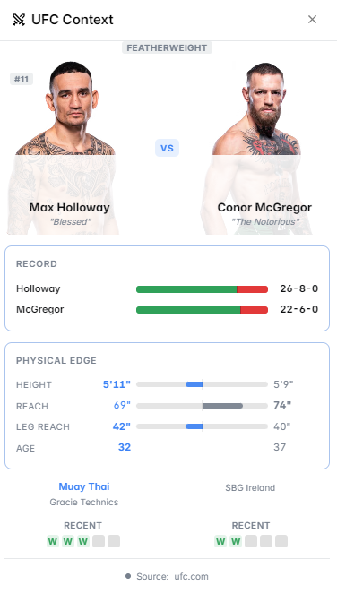

# UFC Context

The **UFC Context** panel loads fighter profiles, records, and rankings directly inside Polymarket — giving you everything you need to trade UFC and MMA markets without leaving the page.

<figure><figcaption>UFC Context panel on a fight outcome market</figcaption></figure>

---

## What It Shows

### Fighter Profiles
For each fighter involved in the market:
- Full name, nationality, and fighting style (striker, wrestler, BJJ, etc.)
- Current UFC ranking (pound-for-pound and divisional)
- Physical stats: height, reach, weight class
- Age and years of professional experience

### Fight Record
Complete professional MMA record for both fighters:
- Wins / Losses / Draws
- Win methods breakdown: KO/TKO, Submission, Decision
- Last 5 fights with results and opponents

### Head-to-Head Stats
Key performance metrics compared side by side:

| Stat | Description |
|---|---|
| Striking accuracy | % of significant strikes landed |
| Striking defense | % of opponent strikes blocked |
| Takedown accuracy | % of takedown attempts completed |
| Takedown defense | % of opponent takedowns defended |
| Submission attempts | Average per fight |

### Recent Fight History
Last 3–5 bouts for each fighter:
- Opponent name and ranking
- Result and method (KO, sub, decision)
- Round and time of finish
- Event name and date

### Ranking Position
- Current divisional ranking
- Recent ranking movement (up/down/new entry)
- Champion and top contenders for context

<figure><figcaption>Side-by-side fighter stats comparison</figcaption></figure>

---

## How to Use It

**For fight outcome markets** (e.g., "Will [Fighter A] beat [Fighter B]?"):
1. Compare the records and recent form — who has momentum going in?
2. Look at the stylistic matchup — does one fighter's style exploit the other's weakness?
3. Check takedown defense vs. takedown accuracy — ground game control often decides close fights
4. Review finish rate — high-finish fighters are riskier to pick on decision markets

**For method of victory markets** (e.g., "Will the fight go to decision?"):
1. Check both fighters' KO/sub rates — if both are finishers, the fight is unlikely to go the distance
2. Look at recent fight history — has the fighter been in wars or dominant performances lately?

**For round betting markets** (e.g., "Will [Fighter] win in Round 1?"):
1. Check first-round finish rate
2. Look at the opponent's chin and durability

---

## Markets Where This Panel Activates

- UFC fight winner markets
- Method of victory markets (KO/TKO, Submission, Decision)
- Round betting markets
- Championship and title fight markets
- Fighter ranking and career outcome markets
