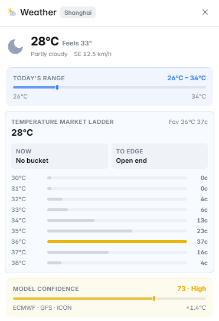

# Weather Forecast

The **Weather Forecast** panel displays 7-day weather forecasts for location-specific markets on Polymarket — from extreme weather events to temperature records.

<figure><figcaption>7-day weather forecast for a temperature market</figcaption></figure>

---

## What It Shows

### 7-Day Forecast
Complete week-ahead weather data for the relevant location:
- Daily high and low temperatures
- Precipitation probability and expected amounts
- Wind speed and direction
- Humidity levels
- UV index

### Severe Weather Alerts
Active weather warnings, watches, and advisories from official meteorological agencies:
- Tornado Watch / Warning
- Hurricane / Tropical Storm advisories
- Blizzard and Winter Storm warnings
- Heat Wave and Extreme Cold advisories
- Flood and Flash Flood warnings

### Historical Comparison
For temperature and precipitation markets:
- Historical averages for the same date range
- How much above or below normal current conditions are
- Record highs and lows for the period in question

### Hurricane / Storm Tracking
For tropical weather markets:
- Current storm position and track
- Intensity (category, wind speed)
- NHC (National Hurricane Center) projected track cone
- Landfall probability by location

<figure><figcaption>Hurricane track cone from National Hurricane Center data</figcaption></figure>

---

## Data Sources

- **NOAA / National Weather Service** — US weather data and severe weather alerts
- **NHC (National Hurricane Center)** — tropical storm and hurricane tracking
- **European Centre for Medium-Range Weather Forecasts (ECMWF)** — high-quality global forecast model
- **OpenWeatherMap** — global weather data aggregation

---

## How to Use It

**For temperature record markets** (e.g., "Will [City] set a new temperature record in [month]?"):
1. Check the 7-day forecast — are temperatures forecast to be extreme?
2. Compare to historical records for the location — how close is the forecast to the record?
3. Factor in model uncertainty — 7-day forecasts are less reliable than 1–3 day forecasts

**For storm and hurricane markets** (e.g., "Will Hurricane [Name] make landfall in [State]?"):
1. Check the NHC projected track cone — which areas are in the cone of uncertainty?
2. Look at model consensus — are different forecast models agreeing on the track?
3. Monitor updates — track forecasts update every 6 hours and can shift significantly

**For sports-related weather markets:**
Weather data also feeds into NFL and outdoor sports markets where conditions affect game outcomes.

---

## Markets Where This Panel Activates

- Temperature record and extreme weather markets
- Hurricane and tropical storm markets
- Precipitation and drought markets
- Any location-specific weather event market
