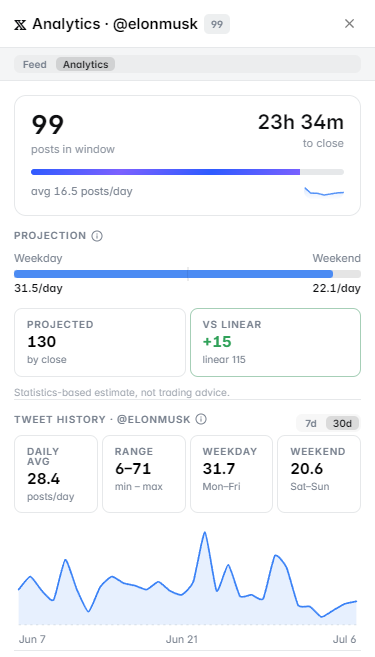

# X Analytics

**X Analytics** gives you deep posting statistics for any X (Twitter) account directly inside Polymarket — no browsing, no external tools. Built specifically for tweet count markets.

Open it via the **Analytics** icon in the right-side panel navigation. The panel has two tabs: **Feed** and **Analytics**.

<figure><figcaption>X Analytics for @elonmusk — 89 posts in window, projection 145 by close, activity heatmap</figcaption></figure>

---

## What the Panel Shows

### Posts in Window
Real-time tracking of posts within the market's resolution period:
- **Posts in window** — how many posts have been made so far in the counting period
- **Time to close** — how much time remains in the window
- **Progress bar** — visual fill of the window
- **Avg posts/day** — current average rate within the active window

### Projection
Statistical projection of where the final count will land:

| Metric | Description |
|---|---|
| **Projected (by close)** | Estimated total posts when the market resolves |
| **Weekday rate** | Average posts/day on Mon–Fri |
| **Weekend rate** | Average posts/day on Sat–Sun |
| **vs Linear** | Difference between the statistical projection and a simple linear extrapolation |

*Note: statistics-based estimate, not trading advice.*

---

## Tweet History

Historical posting data for the account, with a **7d / 30d** selector:

| Metric | Description |
|---|---|
| **Daily avg** | Average posts per day over the selected period |
| **Range** | Min–max posts in a single day |
| **Weekday** | Average posts/day on Mon–Fri |
| **Weekend** | Average posts/day on Sat–Sun |

Includes a **line chart** showing daily post count over time — lets you spot spikes, slowdowns, and whether recent activity is above or below historical baseline.

---

## When Does X Post? (UTC)

Posting time analysis with **All / Weekday / Weekend** selector:

| Metric | Description |
|---|---|
| **Most active hour** | Hour with the highest post count (e.g., 07:00 — 78 posts) |
| **Quietest hour** | Hour with the lowest activity |
| **Avg/hour** | 24h average across all hours |

**Bar chart by time of day** — broken into NIGHT / MORNING / AFTERNOON / EVENING segments, showing the account's typical posting schedule across the full 24-hour cycle.

---

## Avg Posts/Day by Weekday

Bar chart showing average daily post count for each day of the week (Mon–Sun) — reveals whether the account posts more on weekdays or weekends, and which specific days are the most active.

**Example (@elonmusk):** Mon 31.8 / Tue 15.4 / Wed 28.2 / Thu 25 / Fri 29.8 / Sat 32 / Sun 22.3

---

## Weekly Totals

A week-by-week breakdown showing total posts per calendar week — helps identify trends (increasing activity, quiet periods, etc.) and spot outlier weeks.

---

## Activity Heatmap

A GitHub-style calendar heatmap showing posting intensity by day, with a **7d / 14d / 30d** selector.

- **Darker blue** = more posts on that day
- **Light blue** = below-average activity
- **Empty** = no posts

The heatmap immediately shows consistency: does the account post every single day, or are there frequent gaps?

---

## How to Use It

**For tweet count markets** (e.g., "Will @elonmusk post 100+ tweets May 8–15?"):
1. Check **Posts in window** — how far is the current count from the target?
2. Look at the **Projection** — does the statistical model put the final count above or below the threshold?
3. Check the **Weekly totals** — are recent weeks running above or below the market's implied count?
4. Look at the **Posting time chart** — if most posts happen in the morning (UTC) and the window closes at noon, most activity may already be in

**For "will they post at all?" markets:**
1. Check the **Activity heatmap** — does this account ever go silent?
2. Look at the **Weekday/Weekend split** — if the window falls over a weekend and the account typically posts less then, adjust your estimate

---

## Feed Tab

Alongside the Analytics tab, the **Feed** tab shows the account's actual recent posts directly in the panel — so you can read the content without leaving Polymarket.

---

## Markets Where This Panel Activates

- Tweet count and posting frequency markets
- Any market about a specific X account's activity
