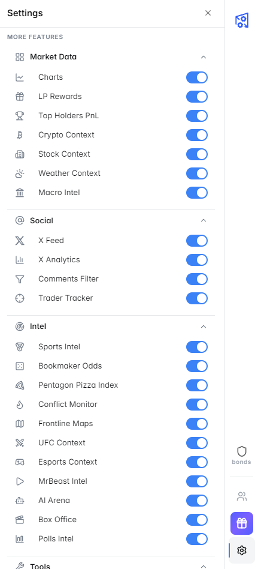

# How It Works

## Technical Overview

PolyHelper is a **browser extension** built on the Chrome Extensions (Manifest V3) standard. It works by injecting lightweight UI components into Polymarket pages — adding new informational panels to the existing interface without altering or replacing any native functionality.

---

## Architecture

  

    🌐
    

      
polymarket.com

      
Prediction market platform

    

  

  
↓

  

    
PolyHelper Extension

    

      

        
⚡ Content Scripts

        
Detect market type Inject sidebar panels

      

      

        
⚙️ Background Worker

        
Fetch data from APIs Cache &amp; refresh data

      

    

    

      
📡 Data Sources

      

        
₿ Crypto feeds

        
🏆 Sports APIs

        
📰 News / X

        
📊 Polling data

        
📈 Macro econ

        
🌍 Geopolitics

      

    

  

  
↓

  

    ✅
    

      
Enhanced Polymarket UI

      
Your panels · Your data · Your edge

    

  

---

## Smart Market Detection

PolyHelper automatically detects the **type of market** you're viewing and loads the relevant data panels. You don't need to configure anything manually.

| Market Type | Auto-loaded Panels |
|---|---|
| Crypto / Token | Crypto Context Panel, Price Charts, Live News |
| Sports (NBA, NFL, etc.) | Sports Intel, Live News |
| Politics / Elections | Polls Intel, Live News, Top Holders PnL |
| Stocks / Equities | Stocks Context, Macro Intel |
| Geopolitics / Military | Pentagon Tracker, Conflict Radar, Military Maps |
| AI / Technology | AI Arena, Live News |
| Entertainment / Box Office | Box Office Projections |
| Weather | Weather Forecast |
| Bonds / Finance | Bonds Tracker, Macro Intel |

---

## Data Flow

1. **You open a Polymarket market page**
2. PolyHelper's content script detects the market category
3. Relevant panels are injected into the sidebar
4. The background service worker fetches live data from multiple APIs
5. Data is rendered in real-time inside the panels
6. Panels refresh automatically as new data becomes available

---

## Privacy & Security

PolyHelper is designed with user privacy as a priority:

- **No wallet access** — the extension never reads your private keys or seed phrase
- **No trade execution** — PolyHelper is purely informational; it cannot place, modify, or cancel orders
- **No personal data collection** — usage data is not sold or shared with third parties
- **Open permissions** — the extension only requests the permissions it needs to function on Polymarket


PolyHelper will **never** ask for your wallet's seed phrase, private key, or password. If you see such a request, it is not from PolyHelper.


---

## Panel System

Each panel in PolyHelper is an independent module. You can:

- **Expand / collapse** individual panels
- **Scroll** through panel content independently
- **Interact** with some panels (e.g., filter comments, view detailed charts)

Panels are loaded lazily — only the panels relevant to the current market are fetched and rendered, keeping performance impact minimal.

---

## Keeping Data Fresh

PolyHelper uses a smart caching and refresh system:

| Data Type | Refresh Rate |
|---|---|
| Crypto prices | Every 30 seconds |
| Sports scores | Live / every 60 seconds |
| News feed | Every 2–5 minutes |
| Poll averages | Every 6–12 hours |
| Economic indicators | Daily |
| Military maps | Every few hours |

---

## Customization — Settings Panel

Don't need a specific tool? You can turn off any feature individually. PolyHelper is fully customizable.

**How to open Settings:**
Look for the **gear icon ⚙️** in the right-side tab bar of the extension — click it to open the Settings panel.

<figure><figcaption>Settings panel — toggle any feature on or off</figcaption></figure>

Features are organized into three categories:

**Market Data**
| Feature | Description |
|---|---|
| Charts | Real-time charts from resolution source |
| LP Rewards | Daily reward rates on market rows |
| Top Holders PnL | PnL breakdown for top holders |
| Crypto Context | Market data, derivatives, ETFs for crypto events |
| Stock Context | Company analytics, earnings, holdings for stock events |
| Weather Context | Current conditions & forecast for weather events |
| Macro Intel | Economic indicators & release dates for macro events |

**Social**
| Feature | Description |
|---|---|
| X Feed | Twitter/X feed on event pages |
| X Analytics | Author feed & posting analytics for tweet markets |
| Comments Filter | Filter comments by holder positions |
| Trader Tracker | Follow traders, group them, and watch their live activity |

**Intel**
| Feature | Description |
|---|---|
| Sports Intel | ESPN standings & recent games |
| Bookmaker Odds | Live Pinnacle/Betfair odds vs Polymarket prices |
| Pentagon Pizza Index | DOUGHCON indicator (OSINT) |
| Conflict Monitor | NASA satellite fire detection for conflict zones |
| Frontline Maps | ISW conflict maps for territorial markets |
| UFC Context | Fighter profiles, records, rankings |
| Esports Context | LoL, Valorant, Dota 2 standings & teams |
| MrBeast Intel | View velocity & attention signal for YouTube events |
| AI Arena | Chatbot Arena rankings & benchmarks for AI model markets |
| Box Office | Daily grosses, projections & comparables for movie markets |
| Polls Intel | Polling data vs market prices for elections |

**Tools**
| Feature | Description |
|---|---|
| Bonds Scanner | High-probability market yield scanner |
| Update Notifier | Notifies when a newer version is on the store |
| Profile Enhancer | Extended trader analytics on profile pages |

Every toggle saves instantly — no need to reload the page.


Not sure which tools you need? Leave everything on by default and turn off what you don't use as you go.


---

## Next Steps

Now that you understand how PolyHelper works, explore all the available analytics tools:

- [Overview of all features →](../features/overview.md)
- [Crypto Context Panel →](../features/crypto-context.md)
- [Earn reward points →](../rewards/program.md)
