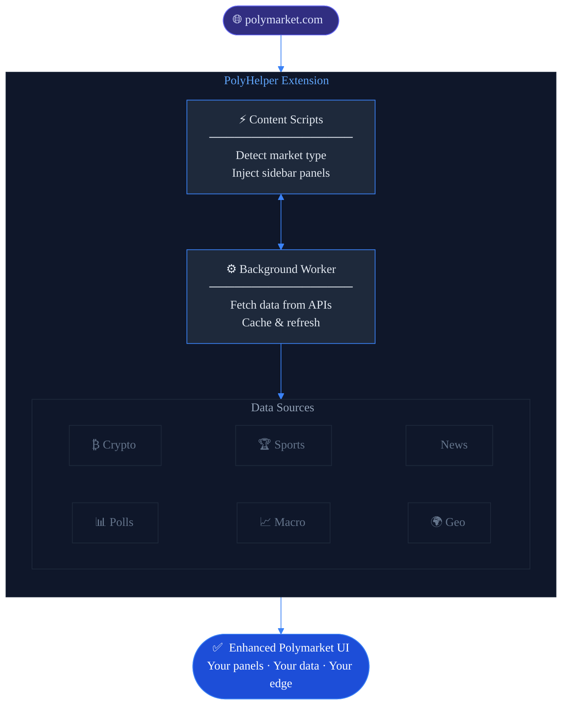

# How It Works

## Technical Overview

PolyHelper is a **browser extension** built on the Chrome Extensions (Manifest V3) standard. It works by injecting lightweight UI components into Polymarket pages — adding new informational panels to the existing interface without altering or replacing any native functionality.

---

## Architecture

---

## Smart Market Detection

PolyHelper automatically detects the **type of market** you're viewing and loads the relevant data panels. You don't need to configure anything manually.

| Market Type | Auto-loaded Panels |
|---|---|
| Crypto / Token | Crypto Context Panel, Price Charts, Live News |
| Sports (NBA, NFL, etc.) | Sports Intel, Live News |
| Politics / Elections | Polls Intel, Live News, Top Holders PnL |
| Stocks / Equities | Stocks Context, Macro Intel |
| Geopolitics / Military | Pentagon Tracker, Conflict Radar, Military Maps |
| AI / Technology | AI Arena, Live News |
| Entertainment / Box Office | Box Office Projections |
| Weather | Weather Forecast |
| Bonds / Finance | Bonds Tracker, Macro Intel |

---

## Data Flow

1. **You open a Polymarket market page**
2. PolyHelper's content script detects the market category
3. Relevant panels are injected into the sidebar
4. The background service worker fetches live data from multiple APIs
5. Data is rendered in real-time inside the panels
6. Panels refresh automatically as new data becomes available

---

## Panel System

Each panel in PolyHelper is an independent module. You can:

- **Expand / collapse** individual panels
- **Scroll** through panel content independently
- **Interact** with some panels (e.g., filter comments, view detailed charts)

Panels are loaded lazily — only the panels relevant to the current market are fetched and rendered, keeping performance impact minimal.

---

## Keeping Data Fresh

PolyHelper uses a smart caching and refresh system:

| Data Type | Refresh Rate |
|---|---|
| Crypto prices | Every 30 seconds |
| Sports scores | Live / every 60 seconds |
| News feed | Every 2–5 minutes |
| Poll averages | Every 6–12 hours |
| Economic indicators | Daily |
| Military maps | Every few hours |

---

## Next Steps

- [Customization & Settings →](customization.md)
- [Privacy & Security →](privacy-security.md)
- [Overview of all features →](../features/overview.md)
- [Earn reward points →](../rewards/program.md)
